# FabricRTI — Real-Time Fraud Detection Workspace

This folder is the **Git-syncable definition** of a complete Microsoft Fabric **Real-Time Intelligence** workspace that powers the end-to-end credit-card fraud detection demo. Sync this folder into a Fabric workspace and every item below is provisioned automatically.

## What's in this folder

| Path | Fabric item | Purpose |
| --- | --- | --- |
| `Databases/MyFraud_EH.Eventhouse/` | Eventhouse | Hosts the KQL database `MyFraud_EH`. |
| `Databases/MyFraud_EH.Eventhouse/.children/MyFraud_EH.KQLDatabase/` | KQL Database | Holds the `Customers` and `CCTransactions` tables. The `DatabaseSchema.kql` file runs on sync and creates both tables + ingestion mappings idempotently. |
| `Events/CreditCardTransactions_es.Eventstream/` | Eventstream | Custom App source → ProcessedIngestion destination that writes incoming JSON events into `CCTransactions` (column auto-mapping by name). |
| `Events/Generate_Customers.Notebook/` | Notebook | Generates synthetic customer profiles with Entra ID–compatible UPNs and ingests them straight into the Eventhouse `Customers` table. |
| `Events/Generate_Credit_Card_Transactions.Notebook/` | Notebook | Reads customers from the Eventhouse, generates ~6 months of synthetic transactions with realistic fraud patterns, and streams them to the Eventstream over 30 minutes. |
| `rx-fraud-alerts.Reflex/` | Reflex (Activator) | Container for the fraud-alert rule. The rule and Cardholder object must be configured in the Fabric UI (see Step 9). |

## Architecture

```text
 Generate_Customers ────────► MyFraud_EH.Customers (KQL table)
                                     │
                                     │ (joined on user_id)
                                     ▼
 Generate_Credit_Card_Transactions ──► Event Hub (Custom App)
                                        │
                                        ▼
                 CreditCardTransactions_es (Eventstream)
                                        │
                                        ▼
                  MyFraud_EH.CCTransactions (KQL table)
                                        │
                                        ▼
                  rx-fraud-alerts (Reflex / Activator)
                                        │
                                        ▼
                  Teams / Email alerts to the cardholder
```

## Setup steps

> Prerequisites: a Fabric-enabled workspace assigned to a Fabric capacity, an Azure Key Vault for the Event Hub connection string, and an Entra ID tenant where you can create test users.

### 1. Create a Microsoft Fabric Workspace

1. Go to the [Microsoft Fabric](https://app.fabric.microsoft.com/) portal. Click **Workspaces** in the left navigation, then click **+ New workspace**.

   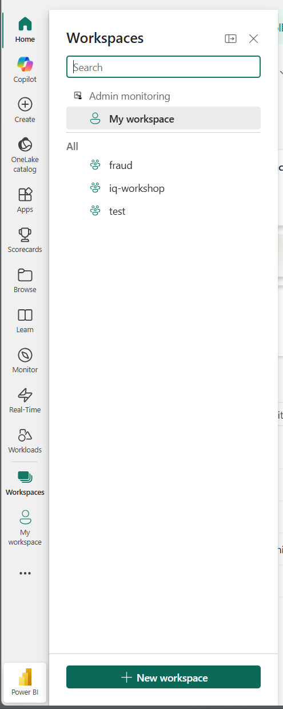

2. Enter a workspace name (e.g. `fraud-real-time-detection`). Expand the **Advanced** section.

   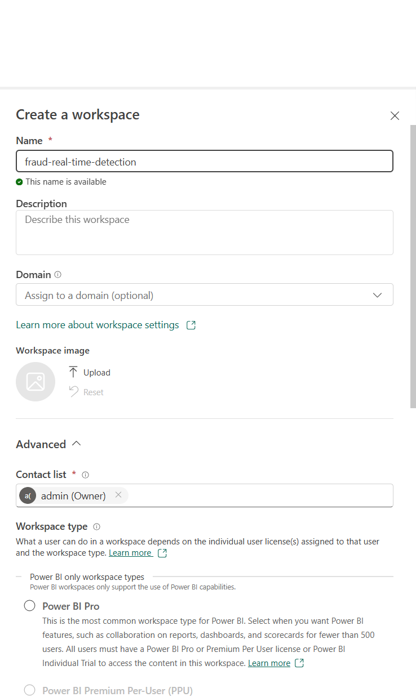

3. Select the **Fabric** workspace type. Under **Details**, choose your Fabric capacity from the dropdown, then click **Apply**.

   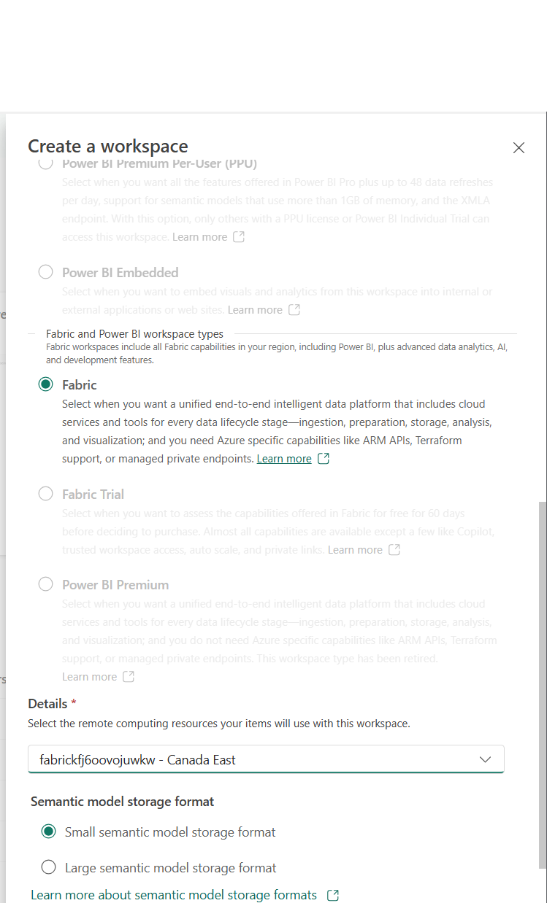

### 2. Resize the Fabric Capacity

The deployment creates the lowest Fabric SKU (**F2**) by default. This is not enough to run the demo workloads (notebooks, Eventstream, and Reflex all require more capacity). Scale the capacity up before proceeding.

> **Cost note:** The Fabric capacity automatically pauses when nothing is running, so you are only charged while workloads are active.

1. In the Azure portal, navigate to your **Fabric Capacity** resource (e.g. under **rg-fraud-detection**).
2. In the left menu, go to **Scale** → **Change size**.
3. Select **F16** (16 Capacity Units) or higher, then click **Resize**.

   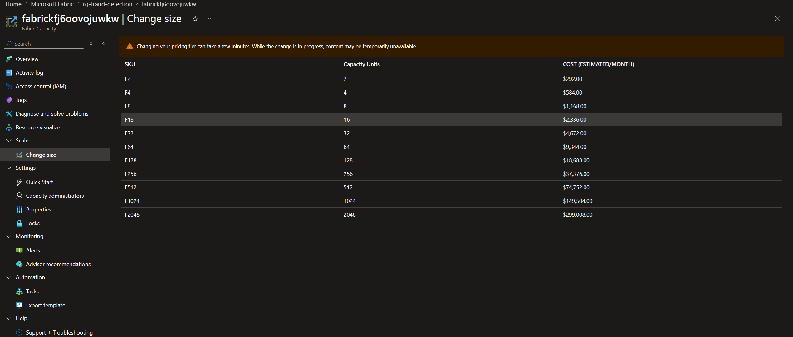

### 3. Connect the workspace to this Git repo

1. First, you need a personal access token (PAT) in GitHub. Go to the developer portal.

   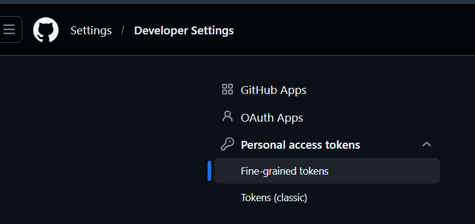

2. Create your PAT with the permissions shown below.

   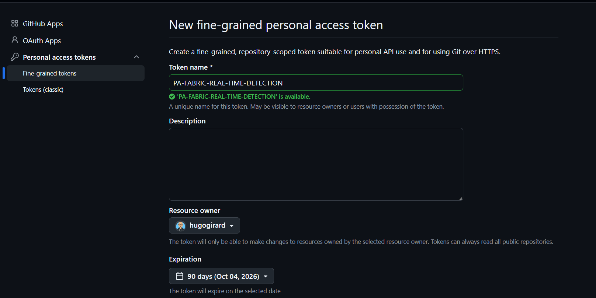
   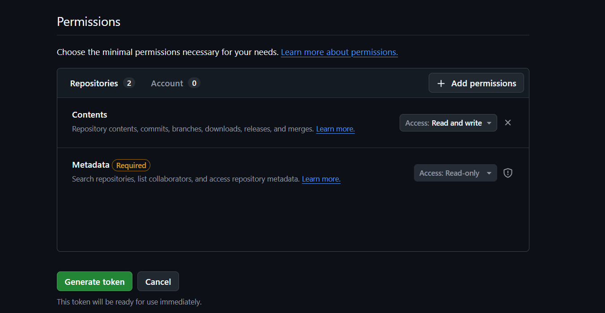

   Click **Generate token** and save it — you will not be able to view it again.

3. In the Fabric portal, click the **Settings** gear icon in the top bar, then under **Governance and administration**, click **Admin portal**.

   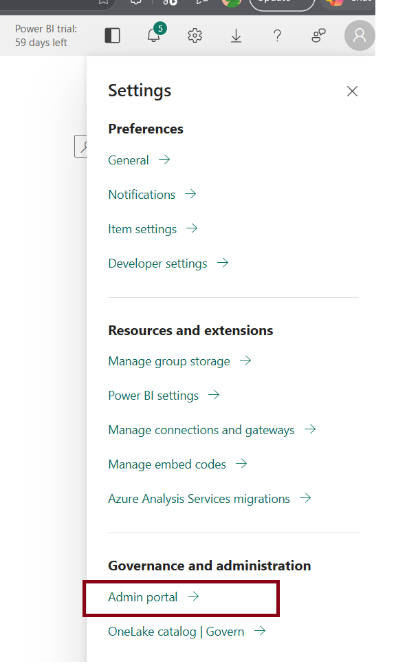

4. In the Admin portal, go to **Tenant settings**, scroll to the **Git integration** section, and ensure **"Users can synchronize workspace items with their Git repositories"** is toggled to **Enabled** and applied to **The entire organization**.

   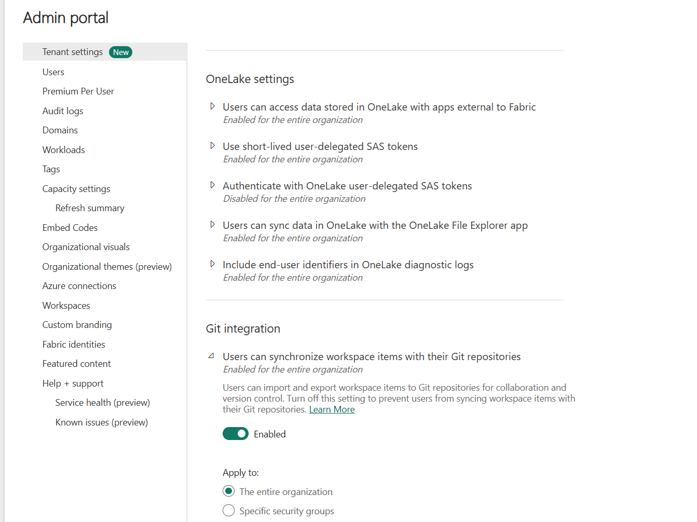

5. In Fabric, open (or create) the target **workspace**.
6. Go to **Workspace settings** → **Git integration** → **Connect**.
7. Select this repository, your branch, and set the **Git folder** to `/FabricRTI`.

   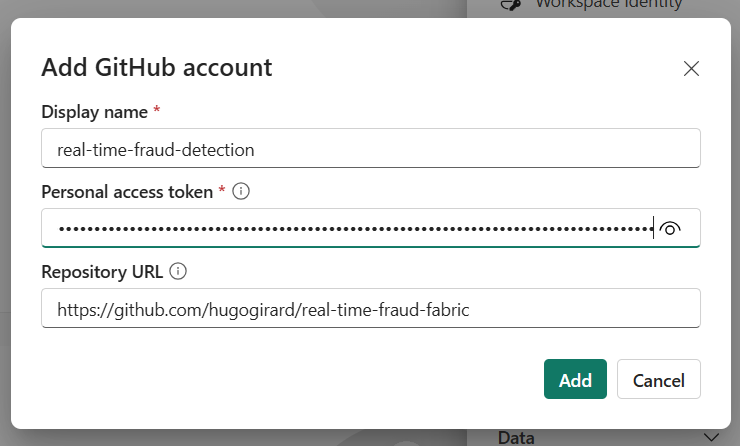

8. Click **Add**.

9. Click **Connect**.

10. A new window will appear.

    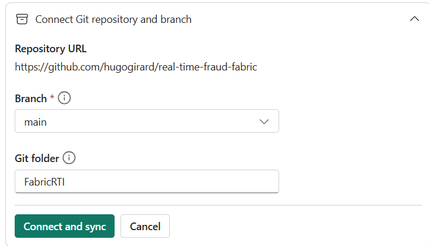

    Select the **main** branch, set the Git folder to **FabricRTI**, and click **Connect and sync**.

11. Wait for the sync to complete.

    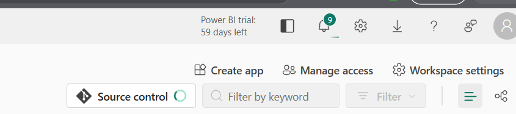

    After sync, the workspace will contain the Eventhouse, KQL database, Eventstream, two notebooks, and the Reflex item.

12. Once everything is synced, you should see the following confirmation window.

    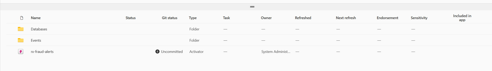

### 4. Verify the KQL database schema

`DatabaseSchema.kql` runs automatically on sync and creates the `Customers` and `CCTransactions` tables plus their ingestion mappings. To confirm:

1. Open the **MyFraud_EH** KQL database.

You should see two tables

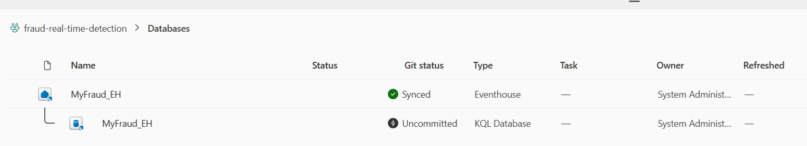
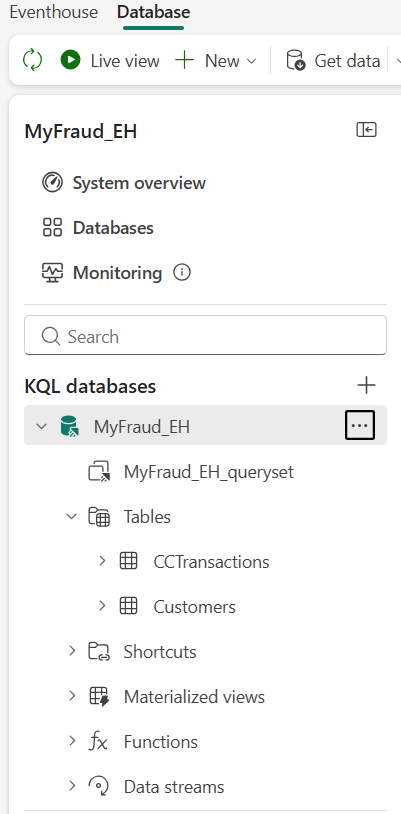


### 5. Generate customers

1. Open **Generate_Customers** in the Events in the workspace.

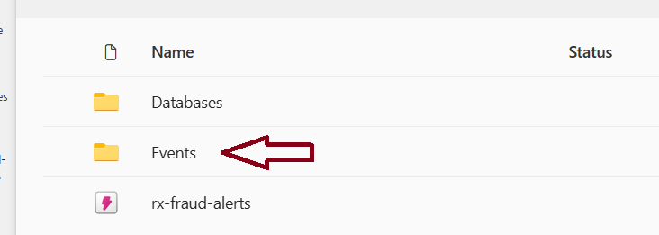
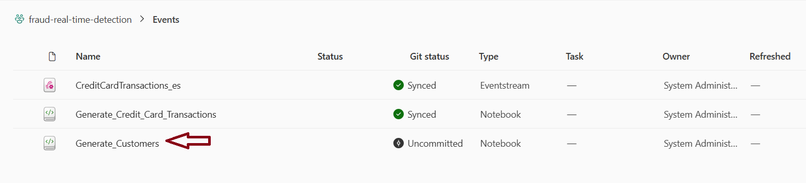

2. In the **Configuration** cell, set:
   - `NUM_USERS` — how many synthetic cardholders to create.
   - `ENTRA_ID_DOMAIN` — your tenant domain (e.g. `contoso.onmicrosoft.com`).
   - `EVENTHOUSE_URI` — the **Query URI** from the Eventhouse **Database details** pane.
   - `KQL_DATABASE` — defaults to `MyFraud_EH`.

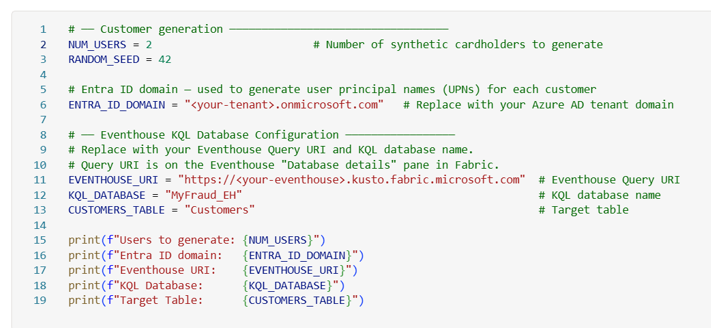

To find the Event URI, go back to the Database and to the right you will see this screen.

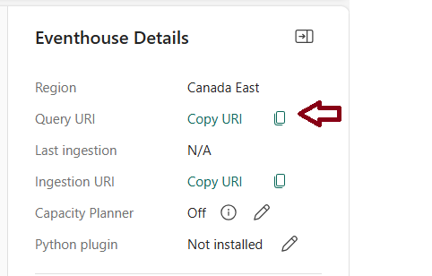

3. **Run all cells**. The notebook authenticates with the Fabric workspace identity, generates the profiles, and queues them for ingestion into `Customers`.
4. Wait 1–5 minutes, then run `Customers | count` in the KQL queryset to confirm the row count.

> **Optional — provision real Entra ID users:** Run `src/fraudstream/rti/Create-EntraID-Customers.ps1` against the same UPN domain so the email addresses in `Customers.email` are deliverable. The PowerShell scripts in `src/fraudstream/rti/` cover account creation and password reset.

### 6. Get the Eventstream connection string

The `CreditCardTransactions_es` Eventstream is pre-defined with a **Custom App** source. You need its connection string so the transaction generator can publish events.

1. Open **CreditCardTransactions_es** and switch the canvas to **Edit** mode.
2. Click the **CreditCardTransactions** source node.
3. In the right pane, open the **Keys** tab and copy the **Connection string–primary key**.
4. In your Azure Key Vault, create a secret named `EventHubConnectionString` and paste the value.

> The Event Hub name (`EntityPath`) is embedded in the connection string — you do not need to set it separately.

### 7. Grant the workspace identity access to Key Vault

Give the **Fabric workspace identity** (or the user running the notebook) the **Key Vault Secrets User** role on the Key Vault so `notebookutils.credentials.getSecret` can fetch the secret at runtime.

### 8. Stream transactions

1. Open **Generate_Credit_Card_Transactions**.
2. In the **Configuration** cell, set `EVENTHOUSE_URI` and `KQL_DATABASE` (same values as Step 4).
3. In the **Stream Transactions to Fabric Eventstream** cell, set:
   - `KEY_VAULT_URL` — e.g. `https://my-kv.vault.azure.net/`.
   - `SECRET_NAME` — defaults to `EventHubConnectionString`.
4. **Run all cells**. Sections 3–10 build the transaction set in memory (a few minutes). The streaming cell then plays them back to the Eventstream over 30 minutes.
5. Watch the Eventstream canvas: events should appear in the data preview within seconds, and rows will start landing in `CCTransactions` shortly after.

### 9. Configure the Reflex (Activator) rule

The `rx-fraud-alerts` Reflex item is created empty on purpose — the Cardholder object and Fraud Alert Email rule are easier to author in the Fabric UI than to maintain in Git.

Follow [`src/fraudstream/rti/README-fraud-alerts.md`](../src/fraudstream/rti/README-fraud-alerts.md) for the click-by-click walk-through:

1. Add an **Eventstream source** pointing at `CreditCardTransactions_es` (DefaultStream).
2. Create a **Cardholder** object keyed on `user_id`, with properties for `email`, `display_name`, `amount`, `merchant_name`, `merchant_city`, `is_fraud`, `fraud_type`, `distance_from_home_km`.
3. Add a **Fraud Alert Email** rule that fires when `is_fraud == 1` and sends an email to `{email}` referencing the cardholder and the suspicious transaction.

## Notes on Git sync

- The `.platform` files use **schema version 2.0** (Fabric Git Integration v2.0.0) and contain stable `logicalId` GUIDs — do not change them or sync will treat items as new.
- The Eventhouse is the **parent** item; its KQL database lives under `.children/MyFraud_EH.KQLDatabase/` and binds back via `parentEventhouseItemId` in `DatabaseProperties.json`.
- The Eventstream destination uses **ProcessedIngestion** with `inputSerialization=Json`, so JSON fields whose names match `CCTransactions` columns are auto-mapped — no ingestion-mapping reference is required.
- Renaming a folder here renames the Fabric item on next sync. The Reflex displayName (`rx-fraud-alerts`) matches the default referenced by `Deploy-FraudAlerts.ps1` and the fraud-alerts README.
