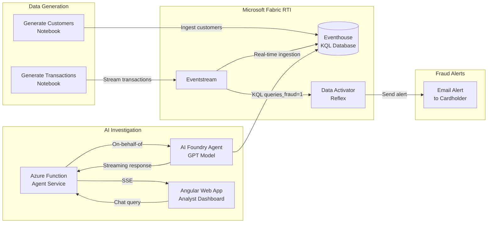
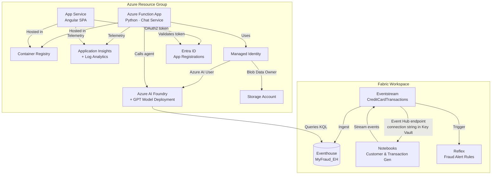

# Real-Time Fraud Detection with Microsoft Fabric

An end-to-end real-time fraud detection solution built on **Microsoft Fabric Real-Time Intelligence** and **Azure AI Foundry**. The system generates synthetic credit card transactions, streams them through Fabric Eventstream into a KQL database (Eventhouse), and uses Data Activator (Reflex) to detect fraudulent transactions and send automated email alerts to affected cardholders — all in real time.

In addition to the streaming fraud-detection pipeline, the solution includes an **AI-powered analyst chat interface** where fraud investigators can query transaction history, ask about suspicious patterns, and get natural-language insights powered by an Azure AI Foundry agent (GPT model). The chat is served through an Angular web app authenticated via Entra ID, backed by a Python Azure Function that orchestrates the AI agent using an on-behalf-of token flow.

## Solution Concept



## Azure & Fabric Deployment Architecture



## Getting Started

| Step | Description | Guide |
|------|-------------|-------|
| 1 | **Deploy Azure infrastructure** — provision all Azure resources with `azd up` | [docs/deployment.md](./docs/deployment.md) |
| 2 | **Configure Microsoft Fabric workspace** — set up Eventhouse, Eventstream, notebooks, and Reflex | [FabricRTI/Readme.md](./FabricRTI/Readme.md) |

## Project Structure

```
infra/                    # Bicep IaC templates (deployed by azd)
  main.bicep              #   Entry point – subscription-scoped deployment
  core/                   #   Modular resource definitions
    AI/                   #     Foundry + model deployment
    apim/                 #     API Management (optional)
    container/            #     Container Registry
    data/                 #     Microsoft Fabric capacity
    entraID/              #     App registrations
    function/             #     Function App
    identity/             #     Managed Identity
    log/                  #     App Insights + Log Analytics
    rbac/                 #     Role assignments
    storage/              #     Storage Account
    web/                  #     App Service (Web App)
FabricRTI/                # Fabric workspace items (Git-synced)
  Databases/              #   Eventhouse + KQL schema
  Events/                 #   Eventstream + Notebooks
  rx-fraud-alerts.Reflex/ #   Data Activator fraud rules
src/
  functions/              # Python Azure Function (AI agent backend)
  web/                    # Angular frontend (analyst chat UI)
  fraudstream/            # Fabric RTI deployment scripts & notebooks
docs/
  deployment.md           # Azure infrastructure deployment guide
```
